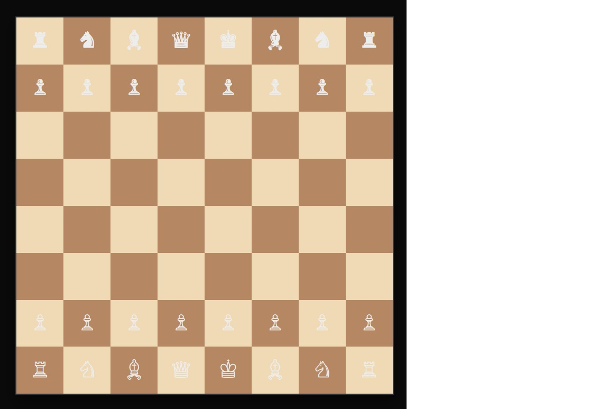

# Smart Chess Game ♟️

A modern, interactive Chess game built with **Next.js** and **TypeScript**. This project features a custom-built Artificial Intelligence capable of challenging users using classic game theory algorithms.



## Project Structure

```
chess
├── public
│   ├── favicon.ico          # Favicon for the application
│   └── vercel.svg          # Vercel logo for branding
├── src
│   ├── components
│   │   ├── Board.tsx       # Renders the chessboard and manages game state
│   │   ├── Piece.tsx       # Represents a chess piece and handles rendering and movement
│   │   └── Square.tsx      # Represents a square on the chessboard and handles click events
│   ├── pages
│   │   ├── _app.tsx        # Custom App component for initializing pages
│   │   ├── _document.tsx    # Custom Document component for augmenting HTML and body tags
│   │   └── index.tsx       # Main entry point rendering the chessboard
│   ├── styles
│   │   ├── Chess.module.css # CSS styles specific to chess components
│   │   └── globals.css      # Global CSS styles for the application
│   ├── utils
│   │   └── chessLogic.ts    # Utility functions for chess game logic
│   └── app
│       ├── layout.tsx       # Defines the layout for the application
│       └── page.tsx         # Main page rendering the layout and content
├── package.json             # Configuration file for npm
├── tsconfig.json            # Configuration file for TypeScript
└── README.md                # Documentation for the project
```

## 🚀 Features

- **Complete Game Logic**: Implementation of all standard chess rules (basic moves, castling, en passant, and promotion).
- **Artificial Intelligence**:
  - **Minimax Algorithm** with adjustable depth.
  - **Alpha-Beta Pruning** to optimize calculation speed.
  - **Positional Evaluation**: Piece-Square Tables to help the AI understand strategic concepts like center control.
  - **Mobility Incentive** to prevent passive play and encourage board control.
- **Responsive Interface**: The board automatically adjusts to screen size while maintaining the correct aspect ratio.
- **Endgame Detection**: Recognizes Checkmate, Stalemate, and Threefold Repetition.

## 🛠️ Technologies Used

- **Framework**: [Next.js](https://nextjs.org/) (React)
- **Language**: TypeScript
- **Styling**: CSS Modules (Clean, responsive design)
- **Logic**: Custom chess engine written in pure TypeScript.

## 📦 Installation and Usage

Follow these steps to run the project locally:

1.  **Clone the repository**:
    ```bash
    git clone [https://github.com/your-username/smartchess.git](https://github.com/your-username/smartchess.git)
    cd smartchess
    ```

2.  **Install dependencies**:
    ```bash
    npm install
    # or
    yarn install
    ```

3.  **Start the development server**:
    ```bash
    npm run dev
    ```

4.  Open your browser at [http://localhost:3000](http://localhost:3000).

## 🧠 How does the AI work?

The "magic" behind the virtual opponent resides in `src/utils/chessLogic.ts`:

1.  **Move Generation**: The AI calculates all legal moves for the current position.
2.  **Decision Tree (Minimax)**: It simulates future turns (currently with a depth of 3) to predict the opponent's best response.
3.  **Optimization**:
    - Uses **Alpha-Beta Pruning** to discard branches of the tree that don't need to be explored, significantly speeding up calculations.
    - **Move Ordering**: Prioritizes captures to make pruning more effective.
4.  **Evaluation Function**: Assigns a score to the board based on:
    - **Material**: Piece values (Pawn=100, Knight=320, etc.).
    - **Position**: Bonuses if pieces are on advantageous squares (e.g., Knights in the center).
    - **Mobility**: A small bonus for having more move options than the opponent.

## 🔮 Future Improvements

- [ ] Add a difficulty selector (adjusting Minimax depth).
- [ ] Implement a chess clock.
- [ ] Display move history (Algebraic Notation).
- [ ] Sound effects for moves and captures.


## Author
Developed by [Virginia Toledo](https://github.com/VirginiaXiao148).